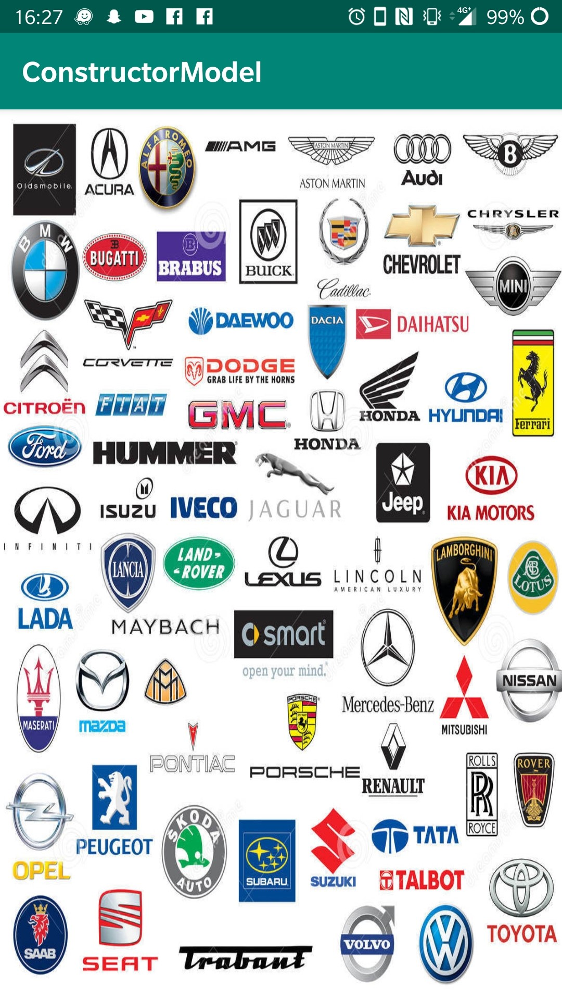

<h1>Application Voiture et Moto</h1>

<p1>Créateur du projet : Junger Damien 3A33</p1>

<h2>Présentation :</h2>

Le projet est une application mobile codée sur Android Studio qui regroupe les modèles de marques de voitures et de motos. 

Cette application affiche donc tous les modèles d'un constructeur recueillis grâce à une API trouvée sur un github qui permet de trier en fonction d'une ID et du type de véhicule du constructeur. 

<h2>Consignes respectées:</h2>

-Architecture & MCV

-Appels REST

-Affichage de plusieurs listes dans des RecyclerView

-Affichage d'un item d'une liste 

-Ecrans : 6 activités

-Fonctions supplémentaires : 
	
	-Placement d'un écran d'accueil 
	-Fond d'écran sur deux écrans 
	-Intégration d'une barre de recherche 

<h2>Fonctionnalités:</h2>

	<h3>HomePage</h3>

Le premier écran affiche une image de logo pendant 5 secondes.

	<h3>Ecran d'accueil</h3>

Cet écran permet de choisir le type de véhicule qu'on veut choisir. 

 

	<h3>Ecran avec la liste des voitures</h3>

Affiche la liste de tous les constructeurs de voitures.

 

	<h3>Ecran avec les modèles de voiture</h3>

Modèle de chaque constructeur.

 
	
	<h3>Ecran avec la liste des motos</h3>

Affiche la liste de tous les constructeurs de motos.

	<h3>Ecran avec les modèles de motos</h3>

 
	<h3>Ecran avec la barre de recherche</h3>

Lorsqu'on entre une recherche pour une marque, cela nous affiche les compatibilités.

 

